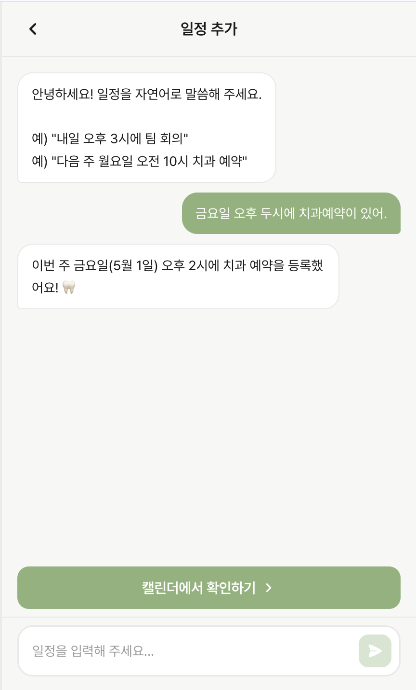
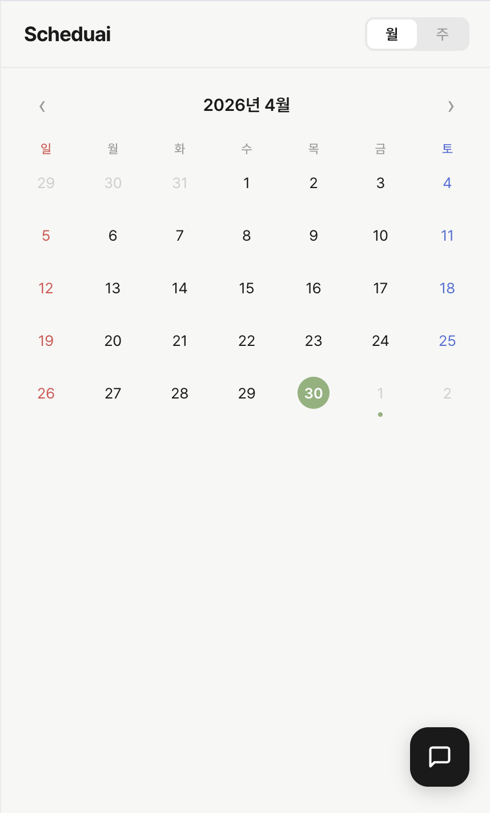
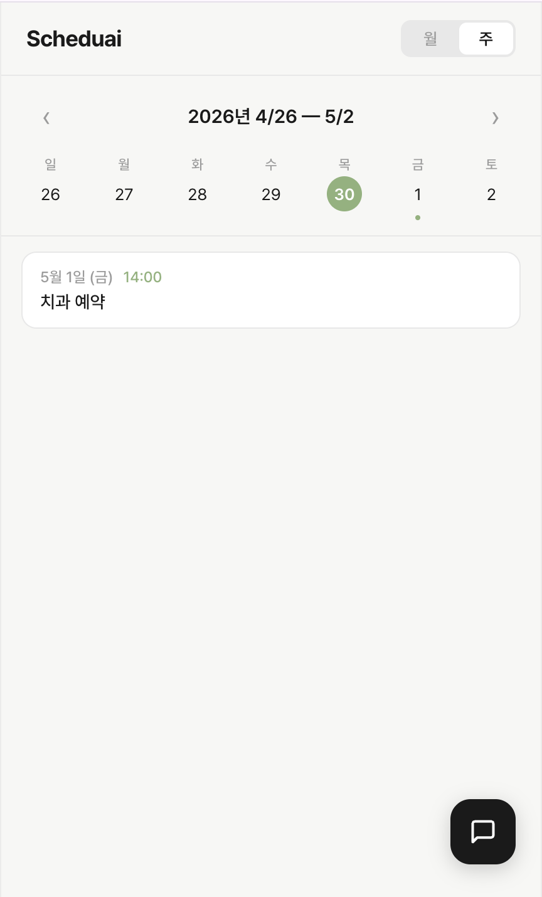

# SchedulAI

## 프로젝트 소개

**SchedulAI**는 자연어로 입력한 일정을 AI가 분석하여 캘린더에 자동으로 정리해주는 일정 관리 애플리케이션입니다. 
 사용자가 복잡한 입력 과정 없이 채팅으로 손쉽게 일정을 등록할 수 있어 직관적인 일정 관리를 할 수 있습니다.

사용자는 채팅 UI를 통해 일정을 자유롭게 입력할 수 있으며, AI가 날짜, 시간, 일정 내용을 해석하여 캘린더에 등록합니다.
등록된 일정은 캘린더와 위클리 뷰를 통해 직관적으로 확인할 수 있어 보다 편리한 일정 관리가 가능합니다. 

---

## 주요 기능

### 1. 채팅 UI를 통한 일정 입력

- 자연어 기반 일정 입력 지원
- AI가 입력된 문장을 분석하여 일정 자동 정리
- 별도의 복잡한 입력 없이 대화하듯 일정 등록 가능

예시:  
다음 주 화요일 오후 3시에 팀 회의  
금요일 저녁 7시에 친구와 저녁 약속

### 2. 캘린더/위클리 뷰

- 월간 및 주간 단위 일정 확인
- 등록된 일정을 날짜별로 시각적으로 확인 가능

---

## 프로젝트 화면

### 채팅 UI

---

### 캘린더 뷰

---

### 위클리 뷰

---

## 기술 스택

| 구분 | 기술 |
|---|---|
| Frontend | React, JavaScript |
| API | Claude API |

